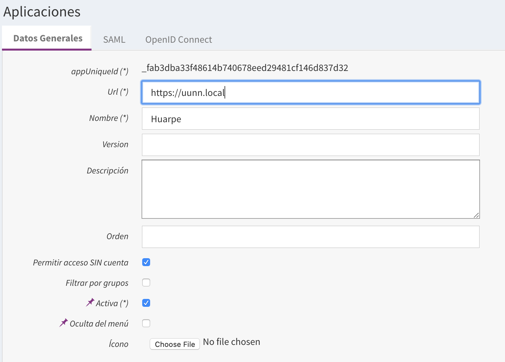
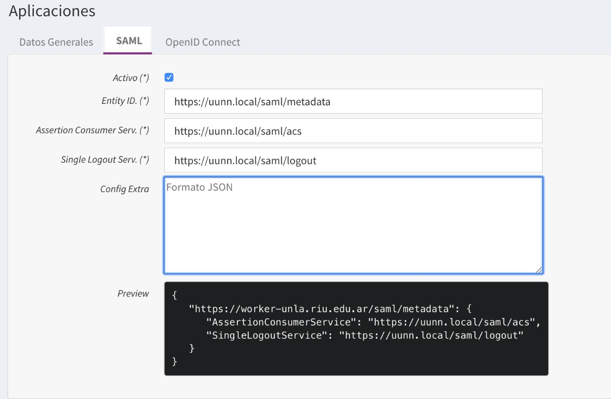

Desde la raíz del  [repositorio](repo-config.md) navegue a la carpeta donde se encuentra la configuración de Araí 3.x

```bash
cd prod/arai
```
Sobre esta carpeta se procederá a adaptar los archivos de configuración a las necesidades de su instalación y luego desplegar los distintos stacks.

## Configuración General
### Cambiar dominio

En los archivos de configuración se asume el dominio `uunn.local`, para cambiarlo por el dominio definitivo puede utilizar el siguiente comando (reemplace `universidad.edu.ar` por el dominio real que utilizará durante el despliegue)

```bash
sed -i 's/uunn.local/universidad.edu.ar/g' \
    usuarios.api.env \
    usuarios.idp.env \
    usuarios.env \
    usuarios.yml \
    docs.yml \
    docs.env \
    huarpe.env \
    huarpe.yml
```

Huarpe es un caso especial pues existe una expresión regular con la URL que deberemos ajustar:

```bash
sed -i 's/uunn\\.local/universidad\\.edu\\.ar/g' huarpe.env
```

### Secretos en Docker

Los secretos son blobs de información que deben almacenarse de forma segura y no pueden ser versionados. Ejemplos de esto son: passwords, claves de SSH, certificados SSL, etc. Más información [aquí](https://docs.docker.com/engine/swarm/secrets/). 

Los servicios que conforman esta documentación requieren que ciertos secretos estén definidos **antes** de comenzar el despliegue. 

#### Esta es la lista de secretos requeridos por Araí durante el despliegue:

* `usuarios_db_pass`: Password de la conexión con la base de datos.
* `usuarios_ldap_admin_pass`: Password de bind de admin de ldap
* `usuarios_ldap_config_pass`: Password de bind del config de ldap
* `usuarios_pass_salt`: Salt de los passwords generados por Araí-Usuarios
* `usuarios_api_users`: Json que define pares de usuario/password para la autenticación de la API de usuarios
* `usuarios_idp_simplesaml_admin`: Password del panel de control de Administrador provisto con SimpleSAMLPhp
* `docs_api_pass`: Password de la API de Documentos
* `docs_db_pass`: Password de la conexión con Postgres
* `docs_repo_pass`: Password de la conexión con Nuxeo
* `docs_conexion_usuarios`: Credenciales y endpoint de la conexión con Usuarios
* `docs_conexion_sudocu`: Credenciales y endpoint de la conexión con SUDOCU
* `huarpe_secret`: Token de 31 caracteres
* `huarpe_conexion_usuarios`: Credenciales de la conexión por API con Usuarios
* `huarpe_conexion_docs`: Credenciales de la conexión por API con Documentos

#### Creación de secretos
La distribucion provee el script de bash [`secrets.sh.dist`](https://hub.siu.edu.ar/siu/expedientes/-/blob/master/prod/secrets.sh.dist) para ejemplificar como inicializar todos los valores requeridos. Si desea mantener un archivo propio con las claves de su ambiente ejecute:

```bash
cp secrets.sh.dist secrets.sh
```
y **modifique el script** `secrets.sh` con los datos correspondientes a su entorno. Luego ejecutelo para cargar los secretos dentro de Docker.

```bash
./secrets.sh
```
> En el caso que se mantenga un repositorio de configuraciones propio, se recomienda ignorar este archivo y evitar subirlo. Tambien es posible no escribir las claves en archivos y configurar los secretos a mano tomando el script [`secrets.sh.dist`](https://hub.siu.edu.ar/siu/expedientes/-/blob/master/prod/secrets.sh.dist) como referencia.


## Configurar y desplegar Araí-Usuarios

La especificación del stack de este módulo se encuentra en [`usuarios.yml`](https://hub.siu.edu.ar/siu/expedientes/-/blob/master/prod/arai/usuarios.yml). Existen tambien otros archivos de configuración asociados: [`usuarios.api.env`](https://hub.siu.edu.ar/siu/expedientes/-/blob/master/prod/arai/usuarios.api.env), [`usuarios.env`](https://hub.siu.edu.ar/siu/expedientes/-/blob/master/prod/arai/usuarios.env) y [`usuarios.idp.env`](https://hub.siu.edu.ar/siu/expedientes/-/blob/master/prod/arai/usuarios.idp.env)

### Nota sobre la persistencia de datos

> Este stack utiliza un **volumen** llamado `usuarios_assets` para guardar la imagen de perfil de los usuarios. Es importante que el almacenamiento subyacente sea compartido por todos los nodos del cluster donde este stack se este ejecutando para que mantengan entre ellos un estado consistente de la base de imagenes. Para lograr esto se requiere contar con una tecnología de [almacenamiento distribuido](../servicios-base#nfs) (NFS, GlusterFS, etc) montada en cada nodo. Como alternativa al almacenamiento distribuido tambien es posible simplificar el despliegue limitando la ejecución de este stack a un único nodo del cluster conectado al almacenamiento centralizado.

### Acceso a Postgres
Los parámetros de conexión los puede encontrar en el archivo `usuarios.env`, son los siguientes:
```
DB_HOST=db-siu
DB_PORT=5432
DB_DBNAME=usuarios
DB_USERNAME=postgres
DB_SCHEMA=usuarios
```

### Acceso a LDAP
Los parámetros de conexión los puede encontrar en el archivo `usuarios.env`, son los siguientes:
```
LDAP_HOST=ldap
LDAP_PORT=389
LDAP_TLS=0
LDAP_METHOD=user
LDAP_BINDUSER=cn=admin,dc=siu,dc=cin,dc=edu
LDAP_BINDPASS_FILE=/run/secrets/usuarios_ldap_admin_pass
LDAP_SEARCHBASE=dc=siu,dc=cin,dc=edu
LDAP_USERS_OU=usuarios
LDAP_USERS_ATTR=ou
LDAP_ACCOUNTS_OU=usuariosCuentas
LDAP_ACCOUNTS_ATTR=ou
LDAP_GROUPS_OU=groups
LDAP_GROUPS_ATTR=ou
LDAP_NODES=
```

### Creación de Base de Datos
En el sitio de documentación de Araí-Usuarios hay documentación extensa de cómo crear la base de LDAP y Postgres.

> https://documentacion.siu.edu.ar/usuarios/docs/cache/instalacion-bases-ldap/
> https://documentacion.siu.edu.ar/usuarios/docs/cache/instalacion-bases-postgres/

### Generar certificados

Araí-Usuario requiere dos pares de claves para funcionar, una para firmar los tokens SAML y otra para firmar los tokens JWT de OIDC.

Para generar los certificados utilizados para firmar los tokens SAML ejecutar:
```bash
mkdir certs
openssl req -newkey rsa:2048 -new -x509 -days 3652 -nodes -out certs/certificado_idp.crt -keyout certs/certificado_idp.key
```

Para generar los certificados utilizados en OIDC para firmar tokens JWT ejecutar:
```bash
openssl genrsa -out certs/oidc_module.pem 2048
openssl rsa -in certs/oidc_module.pem -pubout -out certs/oidc_module.crt
```
Para finalizar, registre los certificados y claves generadas en Docker.
```bash
docker config create usuarios_idp_saml_cert ./certs/certificado_idp.crt
docker secret create usuarios_idp_saml_key ./certs/certificado_idp.key
docker secret create usuarios_idp_oidc_key ./certs/oidc_module.pem
docker config create usuarios_idp_oidc_cert ./certs/oidc_module.crt
```

### Bootstraping del proyecto

La primera vez que se instala este proyecto es necesario realizar dos tareas administrativas
para que todo funcione correctamente. Las tareas a realizar son:
 * Registrar la UI de Araí-Usuarios como SP 
 * Crear y setear un password para el usuario `admin`

> Para realizar este paso, es necesario que las bases de datos estén [inicializadas](#creación-de-base-de-datos)

Estas dos tareas se realizan ejecutando el siguiente comando:
```bash
ADMIN_PASS=toba1234 docker stack deploy \
    --with-registry-auth \
    -c util/usuarios_crear_admin.yml \
    boot
```
Setee la variable `ADMIN_PASS` al password que desee.


Puede verificar el estado de ejecución del mismo de la siguiente manera:
```bash
docker service logs boot_idm -f
```

Una vez finalizado, puede borrar el stack:
```bash
docker stack rm boot
```

### Desplegar el stack

Finalmente, puede desplegar el stack:

```bash
docker stack deploy --with-registry-auth -c usuarios.yml usuarios
```

> Una vez realizados estos pasos, debería poder acceder en https://uunn.local/usuarios (o el dominio que haya definido)

### Verificar los servicios

Con el despliegue realizado, es posible verificar la configuración hecha ejecutando:

```bash
docker stack deploy --with-registry-auth --compose-file util/usuarios_verificar.yml usuarios_verificar
docker service logs usuarios_verificar_idm -f
docker stack rm usuarios_verificar
```

La verificación mostrará en la salida de su ejecución el chequeo de:
* la versión de la base de datos PostgreSQL
* los esquemas de la base OpenLDAP
* la versión de la imagen Docker respecto a las bases
* conexiones a servicios varios

El servicio anterior requiere que el nodo que ejecuta los comandos Docker sea el mismo donde se despliega el stack `usuarios`, agregarle por tanto el `labels.cmd=usuarios` al nodo para que el servicio `usuarios_verificar` se inicie:

```bash
NODE_NAME=$(docker info --format '{{ .Name }}')
docker node update --label-add cmd=usuarios $NODE_NAME
```

### Configurar logo
Este paso es opcional, pero deseable. 

Para configurar el logo debe seguir los siguientes pasos: 

1. Ingrese a Araí-Usuarios (user `admin` y password seteado [anteriormente](#bootstraping-del-proyecto))
1. Dirigirse al item Aplicaciones
1. Ir a la lupa a la derecha de la fila de la aplicación Araí-Usuarios
1. Cargar el ícono. https://hub.siu.edu.ar/siu/expedientes/-/blob/master/var/logos/usuarios.png

### Habilitar acceso API de usuarios

> Para acceder a la API de usuarios desde fuera del cluster se debe descomentar las siguientes 
> [`líneas`](https://hub.siu.edu.ar/siu/expedientes/-/blob/master/prod/arai/usuarios.yml#L117-125) en el archivo 
> [`prod/arai/usuarios.yml`](https://hub.siu.edu.ar/siu/expedientes/-/blob/master/prod/arai/usuarios.yml#L117-125). Tener
> en cuenta las [recomendaciones de seguridad](../seguridad#filtrar-acceso) al respecto.

Esto se realiza *sólo si* se desea agregar un nuevo usuario y contraseña para lograr que un nuevo cliente se autentifique 
contra la API de Araí-Usuarios. Para esto se debe modificar `secrets.sh` y agregar los datos de acceso en el secret `usuarios_api_users`.

Primero se debe eliminar el servicio y el secret de usuarios_api de la siguiente forma:

```bash
docker service rm usuarios_api

docker secret rm usuarios_api_users
```

Luego, por ejemplo, para agregar el usuario `mi_sistema` con contraseña `mi_sistema` a los clientes permitidos de acceder 
a la api:

```bash
printf '[["documentos","documentos123"],["huarpe","huarpe123"],["mi_sistema","mi_sistema"]]' | docker secret create usuarios_api_users -
```

Luego se debe volver a crear el secret ejecutando `./secrets.sh` y finalmente se debe realizar nuevamente el deploy de usuarios como se indica [`aquí`](#desplegar-el-stack).

Opcional. Es posible verificar el funcionamiento de la API consultando un recurso que devuelve información de versión:

```bash
curl https://universidad.edu.ar/api-usuarios/v2/info -u user:pass
```

Recuerde reemplazar "user:pass" por las credenciales válidas, junto con la URL válida para conectarse a la API. El resultado de la consulta debe ser un JSON conteniendo "nombre", "version", etc.


## Configurar y desplegar Araí-Documentos

La especificación del stack de este módulo se encuentra en [`docs.yml`](https://hub.siu.edu.ar/siu/expedientes/-/blob/master/prod/arai/docs.yml). Existen tambien otros archivo de configuración asociado: [`docs.env`](https://hub.siu.edu.ar/siu/expedientes/-/blob/master/prod/arai/docs.env)

### Conexión con Postgres
* `ARAI_DOCS_URL`: Es la URL base de la API accesible desde fuera
* `ARAI_DOCS_DB_HOST`: Host de la base de datos
* `ARAI_DOCS_DB_PORT`: Puerto de la base de datos
* `ARAI_DOCS_DB_DBNAME`: Nombre de la base de datos
* `ARAI_DOCS_DB_USERNAME`: Usuario de la base de datos 

### Conexión con Nuxeo

* `ARAI_DOCS_REPO_HOST`: Es la url de nuxeo, debe apuntar a la API CMIS <url-host-nuxeo>/nuxeo/atom/cmis/
* `ARAI_DOCS_REPO_USUARIO`: API User de Nuxeo
* `ARAI_DOCS_REPO_CLAVE`: Password asociada al User anterior
* `ARAI_DOCS_REPO_SISTEMA`: Identificador del sistema Ej: uunn
* `ARAI_DOCS_REPO_INSTALACION`: Identificador de la instalación Ej: arai_docs_uun

### Creación de Base de Datos
Se incluye un comando que crea la estructura de la base de datos de Araí-Documentos. Para utilizarlo
ejecutar el siguiente comando:
```bash
docker stack deploy \
    --with-registry-auth \
    -c util/docs_crear_base.yml \
    crear_db_docs
```

Asume que la base de datos especificada en la sección de la "Conexión con Postgres" ya está creada.

### Configurar el Stamper [ BETA ]
Existe un servicio de estampado de PDFs que luego de cualquier autorización
agrega una estampa visible al PDF autorizado. El servicio es funcional pero se encuentra
en **BETA** ya que hay circuitos en los que todavía no fue probado. Más información [aquí](https://documentacion.siu.edu.ar/documentos/docs/stamper/).

Para activarlo en este contexto debe realizar los siguientes modificaciones 
sobre el archivo [`docs.yml`](https://hub.siu.edu.ar/siu/expedientes/-/blob/master/prod/arai/docs.yml):

1. Descomentar las variables de entorno `BETA_STAMPER_ACTIVO=1` y `STAMPER_PARAMS={base_uri:'stamper:8080'}`
2. Descomentar el servicio llamado `stamper`
3. Descomentar la config llamada `docs_stamper_config`
4. Descomentar el secret `docs_stamper_keystore`
5. Descomentar del archivo `application.properties` (ubicado en la carpeta ./prod/arai) las lineas de `resource.protocol` y `resource.base`

#### Crear Firma de Sistema
Es muy importante generar un nuevo secret que contenga el [keystore](https://documentacion.siu.edu.ar/documentos/docs/stamper/#generar-certificado-para-firma-de-sistema).
La clave guardada en este secreto será la *Firma de Sistema* que será incluída en todos
los PDFs. Puede aprender como generar una keystore en esta [guia](https://pki-tutorial.readthedocs.io/en/latest/simple/index.html).


> ACLARACION: 
> Este ejemplo usa una keystore demo que no es segura. En caso de ser una instalacion para producción, debe reemplazarlo por una keystore segura.


Notese que en el proceso de generar una keystore nueva utilizara dos archivos .conf llamados [`root-ca.conf`](https://pki-tutorial.readthedocs.io/en/latest/simple/root-ca.conf.html) y [`signing-ca.conf`](https://pki-tutorial.readthedocs.io/en/latest/simple/signing-ca.conf.html). Previo a utilizar dichos archivos para la configuracion de la keystore, debera modificar el apartado `[ ca_dn ]` poniendo los datos de su universidad aquí

```
[ ca_dn ]
0.domainComponent       = "ar"
1.domainComponent       = "edu"
2.domainComponent       = "universidad"
organizationName        = "Universidad"
organizationalUnitName  = "Universidad"
commonName              = "Universidad"
```

Una vez que se tenga posesión de la keystore a utilizar ejecute el siguiente comando para generar el nuevo secreto.
```bash
docker secret create docs_stamper_keystore ./keystore.p12
```
Luego cree y configure el archivo `docs_stamper.env` para indicarle al stamper los parámetros
del keystore generado:
```bash
cp docs_stamper.env.dist docs_stamper.env
```
Edite el archivo de acuerdo a la keystore generada. (Por ejemplo,
La variable de entorno `ARAI_DOCS_STAMPER_KEYSTORE` debera tener el mismo nombre que la keystore en cuestion. En este caso, `ARAI_DOCS_STAMPER_KEYSTORE=keystore.p12`)

#### Reemplazar logo por defecto
Para reemplazar el logo, lo más simple es cargar el nuevo logo dentro de una 
configuración:
```bash
docker config create docs_stamper_logo nuevo_logo.png
```
Y luego pisar el archivo `firma.png` en la imagen provista. Para hacerlo se puede
agregar una sección de configuración al servicio `stamper` del archivo `docs.yml` como la siguiente:
```
    configs:
      - source: docs_stamper_logo
        target: /app/classes/config/firma.png
```

Para que esto funcione hay que indicar en la sección `config` global de `docs.yml` que
la config fue creada de manera externa al archivo:
```
configs:
  docs_stamper_logo:
    external: true
```

Una vez realizados esos pasos Araí-Documentos agregará una estampa luego de cada
autorización básica.

### Desplegar el stack
```bash
docker stack deploy --with-registry-auth -c docs.yml docs
```


### Habilitar acceso *externo* de API Backend de documentos

> Al habilitar el acceso externo (desde afuera del cluster) al API Backend hay que tener en cuenta las [recomendaciones de seguridad](seguridad#filtrar-acceso) 
> para evitar que otros servicios externos puedan acceder a dicho servicio.

Para habilitar el acceso externo al Backend de la API de Araí-Documentos se debe modificar el archivo 
[`docs.yml`](https://hub.siu.edu.ar/siu/expedientes/-/blob/v1.1.0/prod/arai/docs.yml#L45).

En este archivo se debe agregar las líneas:

```bash
- "traefik.http.routers.docs-backend.rule=Host(`uunn.local`) && PathPrefix(`/docs/rest/backend`)"
- "traefik.http.routers.docs-backend.tls=true"
```

Adicionalmente, como este es un endpoint que no debería quedar publicado se tendrían que adicionar las siguientes lineas (con su correspondiente ajuste):

```bash
- "traefik.http.middlewares.docs-ipwhitelist.ipwhitelist.sourcerange=127.0.0.1/32,172.77.100.0/24"
- "traefik.http.routers.docs-backend.middlewares=security-headers@file,docs-ipwhitelist"
```

Luego se debe realizar el deploy de documentos para actualizar los servicios como se indica [`aquí`](#desplegar-el-stack)


## Configurar y desplegar SIU-Huarpe

La especificación del stack de este módulo se encuentra en [`huarpe.yml`](https://hub.siu.edu.ar/siu/expedientes/-/blob/master/prod/arai/huarpe.yml). Existen tambien otros archivos de configuración asociados: [`huarpe.env`](https://hub.siu.edu.ar/siu/expedientes/-/blob/master/prod/arai/huarpe.env) y [`huarpe_framework.yml`](https://hub.siu.edu.ar/siu/expedientes/-/blob/master/prod/arai/huarpe_framework.yml)

### Conexiones con APIs Rest
Como se dijo antes, este sistema sólo consume información a través de endpoints Rest. 
Estas conexiones están explicitadas en el archivo `huarpe.env` y no deberían cambiar, salvo que se cambie 
la ruta interna en el clúster de Sudocu, Usuarios o Documentos.

### Registrar Huarpe como Service Provider

Dentro de la solución, Araí-Usuarios es el proveedor de identidad de SIU-Huarpe. Por este motivo es necesario registrar a este último como Service Provider (SP) de SAML. 

Para hacerlo debe acceder a manejador de usuarios y seguir estos pasos:

1. Ingrese a Araí-Usuarios (user `admin` y password seteado [anteriormente](arai#bootstraping-del-proyecto))
1. Dirigirse al item Aplicaciones
1. Presionar el botón `Agregar +`
1. Completar de la siguiente manera el tab `Datos Generales`

   * Url: https://uunn.local
   * Nombre: Huarpe
   * Chequear la opción `Acceso Irrestricto`
   * Cómo ícono colocar esta imagen: https://hub.siu.edu.ar/siu/expedientes/-/blob/master/var/logos/huarpe.png
1. Completar de la siguiente manera el tab `SAML`

   * Chequear la opción `Activo`
   * Entity Id: https://uunn.local/saml/metadata
   * Assertion Consumer Serv.: https://uunn.local/saml/acs
   * Single Logout Serv.: https://uunn.local/saml/logout
1. Presionar el botón `Guardar`

### Desplegar el stack
```bash
docker stack deploy --with-registry-auth -c huarpe.yml huarpe
```

> Una vez realizados estos pasos, debería poder acceder a Huarpe en https://uunn.local/ (o el dominio que haya definido)
