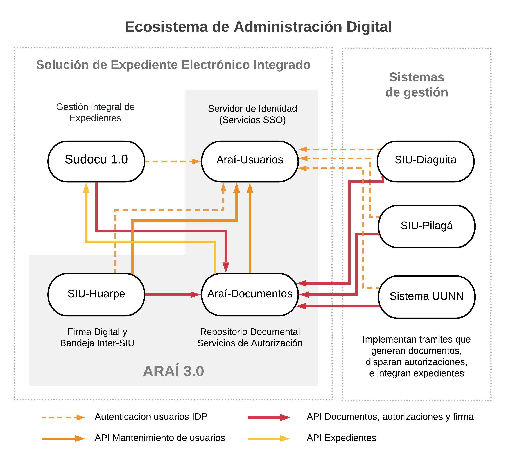

Nuestra **Solución de Expediente Electrónico Integrado** esta compuesta por múltiples componentes que cooperan para construir y sostener la gestión integral de documentos y expedientes de manera distribuida. En este sentido, Sudocu se integra naturalmente con SIU-Araí tanto como IDP con el módulo de Usuarios, cómo con Araí-Documentos a manera de repositorio centralizado y proveedor de soluciones de firma electrónica. En un marco mas amplio esta solución se integra con SIU-Pilagá, SIU-Diaguita y otros sistemas en lo que llamamos **Ecosistema de Administración Digital**: una arquitectura abierta que a través de APIs de integración promueve la interoperabilidad entre todos los sistemas de gestión de la institución.

## Componentes

### Sudocu

Sudocu es un sistema de Gestión Integral de documentos y trámites, con el que se puede crear todo tipo de documentos y expedientes digitales y administrar el ciclo de vida completo de los mismos. El mismo viene con un catálogo de más de 70 tipos de documentos y permite crear y configurar documentos personalizados para cada institución. 

Para mayor información y documentación funcional recurrir a la [página oficial de SUDOCU](https://sudocu.dev/)

### Araí-Usuarios

Arai-Usuarios es un Proveedor y Gestor de Identidad. Mantiene una base de datos común de usuarios, para la que provee una interfaz de gestión y una API Rest para administracion remota. Implementa los protocolos SAML 2.0 y OpenID Connect. Esta compuesto por 3 módulos:

* `idp`: Identity Provider. Es el encargado de mantener la sesión de SSO y recibir los inicios de login y cambios de password.
* `idm-gui`: Identity Manager. Aplicación que permite modificar usuarios y aplicaciones en un entorno gráfico.
* `idm-api`: Es la API Rest del manager. Esta API permite hacer las mismas modificaciones que en la GUI a través de una interfaz Rest.

Para mayor informacion recurrir a [Manual de Araí-Usuarios](https://documentacion.siu.edu.ar/usuarios/docs/intro/)

### Araí-Documentos

Araí Documentos maneja la interacción con la base de datos documental y provee una capa de abstracción para manejar procesos de firma digital.

Tiene dos componentes pricipales, una API Rest con la se comunican el resto de los módulos para interactuar con la base documental y un worker para enviar notificaciones.

Para mayor informacion recurrir a [Manual de Araí-Documentos](https://documentacion.siu.edu.ar/documentos/)

### SIU-Huarpe

Huarpe es un portal centralizador que permite exponer los servicios de los módulos a los usuarios finales. Aporta la bandeja de firma a la Solución de Expediente electrónico.
