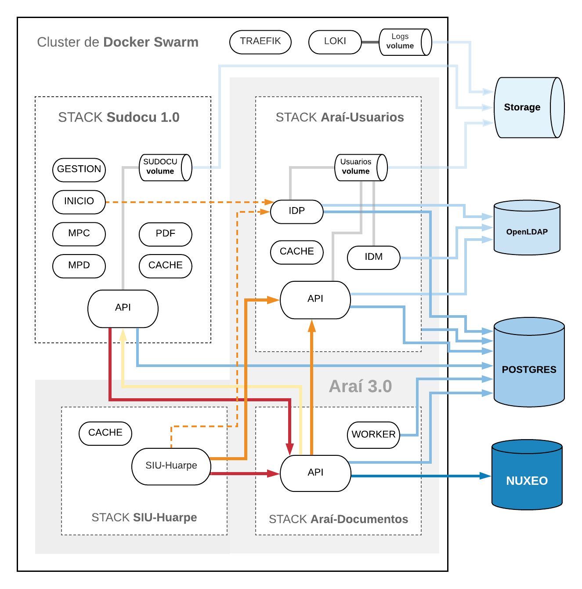

La solución es distribuida como un conjunto de imagenes de Docker. Se provee ademas un conjunto de stacks que especifican como desplegarla con Swarm en un cluster. Si su ambiente de producción utiliza otras tecnologías (orquestadores, servicios, etc) puede utilizar esta especificación como referencia sobre como instanciar las imágenes distribuidas. El siguiente diagrama muestra los contenedores desplegados y sus dependencias.

El stack de SUDOCU se compone de los siguientes componentes:

* `API`: Backend de APIs orientado a microservicios con arquitectura REST.  
* `Inicio`: Frontend de acceso a los componentes, novedades y notificaciones. 
* `Gestión`: Frontend de gestión de documentos, trámites y expedientes.
* `MPD`: Frontend del Módulo de Publicación y Digesto. 
* `MPC`: Frontend del Módulo de Parametrización y Configuración.
* `Cache`: Servicio de cache y sesiones de usuario basado en REDIS.
* `PDF`: Servicio de impresión de PDFs basado en browserless.

Además, dentro del Ecosistema de Administración Digital el stack de SUDOCU también posee un **Volumen** para la persistencia de documentos adjuntos y una base postgresql que se levanta en conjunto con las bases de Arai Usuarios y Arai Documentos. 

@todo: Describir el resto de los stacks
