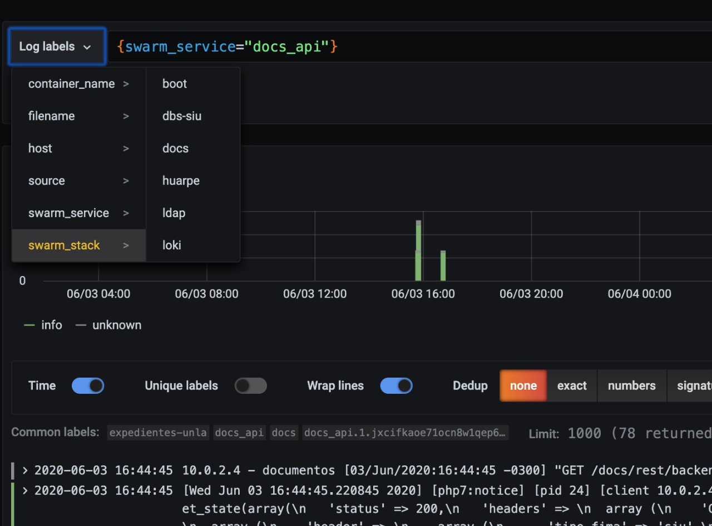

Sin importar el tipo de aplicación que se esté desplegando los logs siempre son una pieza importante de la solución.
En entornos de microservicios son todavía más importantes. 

La forma más popular de resolver el problema de centralización y visualización de logs es a través del stack [ELK](https://www.elastic.co/what-is/elk-stack). Esta solución es muy robusta y provee muchas features, pero su operación, en especial Elastic Search, es bastante compleja. Por eso, si no se cuenta con un stack ELK como servicio, quizá sea mejor analizar otras opciones.

Otra solución que está ganando tracción es [Grafana Loki](https://grafana.com/oss/loki/). Esta solución hace foco en la facilidad de operación a costa de indexar los logs sobre labels en vez de hacer full-text-search.

A continuación se muestra una forma de realizar una instalación funcional mínima de Loki y Grafana, ya que es la herramienta con la que venimos trabajando. Vale la pena aclarar, que si en su institución se decide ir por alguna otra solución sería bueno que comparta su experiencia con la comunidad.

### Modificación de dominio base
Ejecute el siguiente comando para hacer el cambio de dominio base desde el directorio `prod/servicios`:
```bash
export DOMAIN_NAME_URL=universidad.edu.ar
sed -i "s/uunn\.local/${DOMAIN_NAME_URL}/g" \
    loki.yml
```

## Servicio de Loki  
### Clave de acceso
Para generar la clave de loki  
`openssl passwd -apr1 <MICLAVE> | sed 's/\$/\$\$/g'`  
Y luego cargarla en el archivo servicios/loki.yml en el label `- "traefik.http.middlewares.loki-auth.basicauth.users=loki:<MICLAVE>"`  

## Plugin loki en docker swarm  
### Instalación  
Para configurar el plugin de loki ejecutar **en cada nodo de swarm** el comando:

`docker plugin install grafana/loki-docker-driver:2.3.0 --alias loki --grant-all-permissions`

### Configuración tentativa
Para que cada nodo envie automaticamente los logs a loki creamos el archivo `/etc/docker/daemon.json` (setear las variables entre corchetes) **y reiniciamos docker** (para esto se podria utilizar `systemctl restart docker`).  

```
{
    "debug" : true,
    "log-driver": "loki",
    "log-opts": {
        "loki-url": "https://<USUARIO>:<CLAVE>@<DOMAIN_NAME_URL>/loki/loki/api/v1/push",
        "loki-batch-size": "400",
        "loki-timeout": "3s",
        "loki-retries": "3"
    }
}
```
Para poder utilizar certificados *self-signed* deberá insertar la siguiente linea: 

` "loki-tls-insecure-skip-verify": "true" `

Para mas información o configuraciones adicionales la documentación del plugin es esta https://github.com/grafana/loki/blob/v1.5.0/docs/clients/docker-driver/README.md    
### Configuración alternativa
Si no desea los logs del nodo completo puede configurar loki por servicio:    
https://grafana.com/docs/loki/latest/clients/docker-driver/configuration/    
o por contenedor:  
https://grafana.com/docs/loki/latest/clients/docker-driver/configuration/  

## Configuracirón grafana  
### Crear secret  
La clave de grafana se puede generar con
```bash
printf 'grafanapassword' | docker secret create grafana_pass -
```
o mediante el `./arai/secrets.sh.dist` con el resto de las claves

### Acceso desde otras redes
Por default Grafana solo soporta acceso local. para setear las redes desde las cuales necesita acceder puede editar `loki.yml` la sección
```bash
        - "traefik.http.middlewares.grafana-ipwhitelist.ipwhitelist.sourcerange=127.0.0.1/32,<IP-RED/MASCARA>"
```
reemplace <IP-RED/MASCARA> por la IP o RED a autorizar el acceso

## Deploy del stack
En el directorio `servicios` se incluye un stack mínimo de deploy de Loki. Para utilizarlo, ejecute:
```bash
docker stack deploy -c loki.yml loki
```
Es importante notar estos 2 volumenes:
* `log-data`. Este volumen es el que se debe backupear para salvar la historia de logs.  
* `grafana-data`. Este volumen es el que debe backupear para salvar la configuración, usuarios y dashboards de Grafana.

## Acceso a la app
Para puede acceder a la aplicación desde el navegador `universidad.edu.ar/metricas` con usuario admin y la clave seteada como secret

Siga las instrucciones en https://github.com/grafana/loki/blob/v1.5.0/docs/getting-started/grafana.md#loki-in-grafana para poder ver los logs a través de Grafana.

> Esta instalación **NO** es escalable horizontalmente ya que utiliza un backend de Storage (BoltDB) que no lo soporta. Es decir, no puede haber más de 1 replica del servicio. Si esto es deseable, por el momento puede referirse a la documentación de Loki: https://github.com/grafana/loki/tree/v1.5.0/docs.


### Visualización de logs
Si todo funcionó correctamente, a medida que vaya interactuando con los contenedores de su clúster los logs empezarán a aparecer en Grafana. Por defecto se puede filtrar por las siguientes categorías:


También puede construir queries bastante más ricas utilizando el lenguaje provisto por la herramienta, llamado [LogQL](https://github.com/grafana/loki/blob/master/docs/logql.md)
